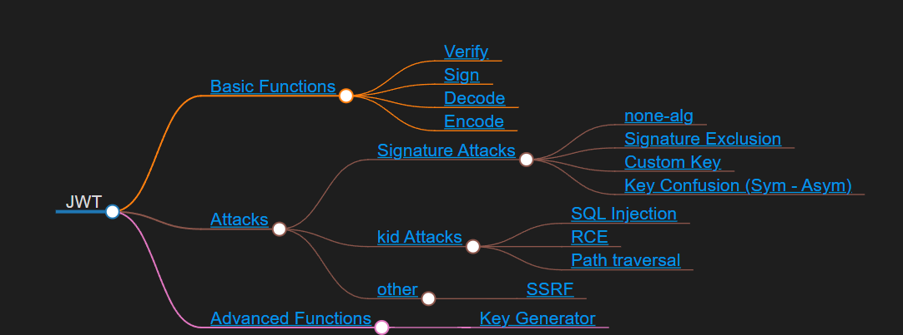

# Expose

## Überblick über die Funktionalität

### Ziel der Arbeit
Das Ziel ist ein Tools für den Umgang mit JWT. Es werden die gängigen Angriffe auf JWT implementiert, um somit eine umfassende Funktionalität zu bieten
Umgesetzt werden sowohl die grundlegenden Funktionen:
- Encoden/Decoden (Möglichkeit für die Erstellung von "defekten" JWTs)
- Signature Verify/Sign
  
Als auch gängige Angriffe auf JWT:
- Signature Attacks (Signature Exclusion, Custom Key, Key Confusion, none-alg ...)
- kid attacks (RCE, Path traversal ...)
- SSRF

Das Tool wird in Javascript geschrieben und eignet sich somit für den Browser. Ein weiterer Schritt wäre die Implementierung direkt in Burp, um hier Angriffe zu automatisieren.

### Methodologie
#### Arbeitspaket 1: grundlegende Funktionalität
Implementierung von den oben genannten Basisfunktionen (Dauer: ??)

#### Arbeitspaket 2: Angriffe
Implementierung der oben genannten Angriffe (Dauer: ??)

#### Arbeitspaket 3: Integration in Burp (incl. Automatisierung ?)
Die Funktionalität wird in Burp implementiert und Angriffe können automatisch ausgeführt werden (Dauer:??)

### Stand der Wissenschaft
Gute Frage, nächste Frage

### Typo 
https://informatik.rub.de/abschlussarbeiten/thesis_nds/bachelor-masterthesis-eigenes-thema-vorschlagen/ 
Auf der Seite ist ein Typo (Beispiel > Wissenschaftlicher Anspruch > "Implemenationen")
